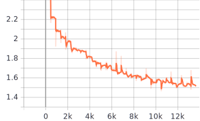
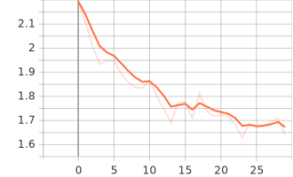

# NSP-fine-tune
Fine-tune BERT using Next Sentence Prediction Loss

- Download checkpoints [here](https://drive.google.com/open?id=10BEBOf0MYTFLcvUCdgsqfX_FD8weZNJD)

## Set up environment and fine-tune BERT
- set up environment
~~~
# current path 
$ pwd
/Users/jiajunb/Desktop/src/LIT/NSP-fine-tune

# create a virtual environment
$ python3 -m venv env

# activate the environment
$ source env/bin/activate 

# install package
$ pip install -e .

~~~

- Process data
~~~
# current path 
$ pwd
/Users/jiajunb/Desktop/src/LIT/NSP-fine-tune

# Processing individual pipeline
$ ./bin/data preprocess # preprocess data
$ ./bin/data pregenerate # add random mask and datasets for all epochs

# or reset all the data
$ ./bin/data reset
~~~

- Train
~~~
# current path 
$ pwd
/Users/jiajunb/Desktop/src/LIT/NSP-fine-tune

$ ./bin/train
~~~

- See training logs
~~~
# current path
$ pwd 
/Users/jiajunb/Desktop/src/LIT/NSP-fine-tune

$ tensorboard --logdir=logs --port 8008 --host 127.0.0.1
TensorBoard 2.0.0 at http://127.0.0.1:8008/ (Press CTRL+C to quit)

# navigate browser to 127.0.0.1:8008
~~~

- Trouble shoot: `-bash: ./bin/<file to execute>: Permission denied`
~~~
chmod +x ./bin/<file to execute>
~~~

~~~
Usage:

Directory Tree:
.
├── README.md
├── assets
│   ├── eval_loss.svg
│   └── mean_loss.svg
├── bin
│   ├── data
│   ├── log
│   ├── pregenerate
│   ├── preprocess
│   └── train
├── checkpoints
├── data
│   ├── interim
│   │   └── transcripts.txt
│   ├── processed
│   └── raw
│       └── transcripts_sentences.json
├── logs
│   └── events.out.tfevents.1572227775.gl1006.arc-ts.umich.edu
├── next_sentence_pred_finetune
│   ├── dataset.py
│   ├── evaluate.py
│   ├── finetune_bert.py
│   ├── inference.py
│   ├── pregenerate_data.py
│   ├── preprocess_data.py
│   ├── simple_lm_finetuning.py
│   ├── train.py
│   └── utils.py
├── sbatch
│   └── train
├── setup.py
├── slurm-1253169.out
└── tests

~~~
